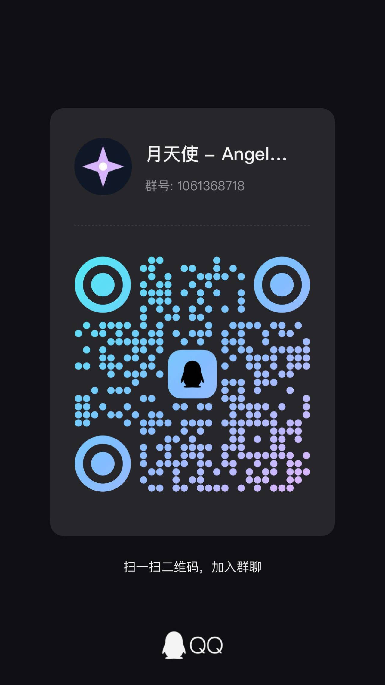

<div align="center">


# Angelus

### 管理一个 Agent 组织，而不只是运行一条工作流。

**本地优先 · 可观测 · 可恢复 · 动态 Agent 控制平面**

[快速开始](#快速开始) · [为什么是 Angelus](#为什么是-angelus) · [架构](#架构) · [Swarm 运行时](#swarm-运行时) · [桌面应用](#桌面应用) · [文档](#文档)

</div>


---

## Angelus 是什么？

**Angelus 是一个面向长周期 Agent 与动态多 Agent 系统的、本地优先的控制平面与工作台。**

大多数 Agent 框架主要解决以下问题之一：

- 定义工作流；
- 连接多个 Agent；
- 在执行节点之间传递状态。

Angelus 更关注另一个问题：

> **当一个 Agent 组织正在真实运行时，我们应该如何观察、控制、修改并恢复它？**

Angelus 的 Swarm 不只是一个预定义好的执行图。

Coordinator 可以在执行过程中发现新的问题、把工作委派给 Worker、创建临时专家、隔离各自的执行上下文，通过 TaskBus 接收结构化报告，并在需要时停止、检查、修改和恢复整个 Swarm。

```text
用户目标
   │
   ▼
Coordinator
   │
   ├── 发现任务 ─────────────► Worker A
   │                              │
   │                              └── 报告 ───────┐
   │                                              │
   ├── 发现新问题 ───────────► Temporary Worker   │
   │                              │               │
   │                              └── 报告 ───────┤
   │                                              │
   ▼                                              ▼
Task Plan ◄──────────── TaskBus ◄──────── Structured Reports
   │
   ▼
产物 · 证据 · 决策 · Trace
```

Angelus 把 **Agent 组织本身视为运行时状态**。

---

# 为什么是 Angelus

## 1. 动态 Agent 组织

传统工作流引擎通常回答：

> 下一个应该运行哪个节点？

Angelus 还需要回答：

> 现在应该有哪些 Agent 存在？
>
> 谁应该负责这个问题？
>
> 谁向谁汇报？
>
> 是否需要临时拉入一个新的专家？
>
> 一个已经完成任务的 Worker 是否应该被复活并重新分配？

因此，Angelus 管理的不只是 workflow state：

```text
Agent population
Delegation topology
Assignments
TaskBus
Plans
Contexts
Artifacts
Execution state
Lifecycle state
```

Angelus 的目标并不只是 dynamic routing。

它更接近 **Dynamic Organization**。

---

## 2. 用报告边界代替“共享一个大脑”

一个 Worker 在执行任务时，可能产生大量中间信息：

- reasoning；
- shell 输出；
- tool result；
- 失败尝试；
- 临时假设；
- 调试轨迹；
- 检索到的文档。

这些信息并不应该默认全部进入 Coordinator 的上下文。

Angelus 将 **执行上下文** 与 **组织通信** 分离。

```text
┌──────────────── Worker 私有上下文 ────────────────┐
│                                                   │
│ reasoning                                         │
│ tool calls                                        │
│ failed attempts                                   │
│ intermediate hypotheses                          │
│ raw execution transcript                         │
│                                                   │
└───────────────────────┬───────────────────────────┘
                        │
                     报告边界
                        │
                        ▼
              ┌──────────────────┐
              │ 结构化工作报告   │
              ├──────────────────┤
              │ conclusions      │
              │ evidence         │
              │ artifacts        │
              │ unresolved work  │
              │ status           │
              └────────┬─────────┘
                       │
                       ▼
                    TaskBus
                       │
                       ▼
                  Coordinator
```

原始执行历史仍会被保留下来，用于审计、复盘和 Trace，但它不需要自动变成决策层的共享对话噪声。

这让跨 Agent 通信更像一个 **API Boundary**，而不是一个无限膨胀的群聊。

---

## 3. 恢复的不只是“第几步”，而是整个组织

Durable execution 并不是 Angelus 独占的能力。

Angelus 更关心的是：**究竟什么值得被恢复？**

一个 Swarm 的恢复状态可以包含：

```text
Swarm
├── topology
├── worker blueprints
├── TaskBus history
├── task plans
├── Agent contexts
├── execution state
└── runtime configuration
```

在进程重启之后，Angelus 可以利用持久化的 runtime 信息和当前执行凭据重建 Swarm。

因此，它希望恢复的不是：

```text
“工作流执行到了第 17 步。”
```

而是：

```text
“此前是这样一个 Agent 组织在处理这个问题。”
```

---

## 4. 它是 Control Plane，而不只是 Python API

“让 Agent 跑起来”并不难。

真正困难的是让一个长时间运行的 Agent 系统始终保持：

- 可观察；
- 可解释；
- 可停止；
- 可修改；
- 可恢复。

Angelus 在 Agent runtime 外围提供一个完整工作台：

```text
                         Angelus
                            │
          ┌─────────────────┼─────────────────┐
          │                 │                 │
          ▼                 ▼                 ▼
      Execution          Control         Observation
       Runtime            Plane             Plane
          │                 │                 │
       Agents             Stop             Timeline
       Swarm              Resume            Trace
       Tools              Steer             Context
       MCP                Spawn             Topology
       Memory             Recover           Plans
       TaskBus            Edit              Artifacts
```

用户不应该只能在系统失控后重新翻 terminal log 猜测发生了什么。

一个运行中的 Agent 系统，本身就应该是可检查的。

---

## 5. Local-first

Angelus 从一开始就围绕本地工作站设计，而不是要求用户先搭建远端 Agent 基础设施。

会话、事件、上下文、Swarm 快照与产物默认保存在本机。

Angelus 可以作为：

- 浏览器中的本地工作台；
- Python 控制平面；
- Tauri 桌面应用。

桌面发布版本会将 Python 后端打包为 sidecar，因此最终用户不需要提前准备 Python 环境和虚拟环境。

---

# Angelus 与其他平台的定位

Angelus 并不试图宣称“其他框架做不到这些事情”。

更准确地说，不同系统选择了不同的主要抽象。

| 平台 | 主要抽象 | 主要问题 |
| --- | --- | --- |
| **CrewAI** | Crew / Task / Flow | 一组角色应该如何完成既定工作？ |
| **AutoGen** | Agent / Message / Runtime | Agent 之间应该如何通信和交互？ |
| **LangGraph** | Node / State / Graph | 状态化 Agent 工作流应该如何可靠执行？ |
| **HumanLayer ACP** | Kubernetes-native Agent infrastructure | 长周期 Agent 应该如何运行在云基础设施中？ |
| **Angelus** | **Agent Organization / Control Plane** | **一个运行中的 Agent 组织应该如何演化、汇报、恢复并保持可控？** |

也可以更简单地理解为：

```text
CrewAI     → 组织任务协作
AutoGen    → 组织 Agent 通信
LangGraph  → 组织状态化执行
ACP        → 组织 Agent 基础设施

Angelus    → 组织正在运行的 Agent 组织本身
```

这些系统的能力之间存在重叠。

这里强调的是 **design center**，而不是理论上的能力边界。

---

# 核心能力

## Agent Runtime

- 单 Agent 执行；
- 多 Agent Swarm；
- Coordinator / Worker 委派；
- 运行时 Worker 创建；
- Worker revival 与重新分配；
- Agent 独立上下文；
- 嵌套任务计划；
- Tool execution；
- 流式模型输出；
- 结构化生命周期事件。

## Swarm Runtime

- 可变 Agent 拓扑；
- TaskBus 工作交接；
- Worker 结构化报告；
- 依赖驱动任务执行；
- split / gather；
- assignment 与 plan task 绑定；
- Swarm snapshot 持久化；
- 进程重启后的 Swarm 恢复。

## Run Control

- 协作式停止；
- Agent `stop_turn`；
- 强制停止；
- 已登记工具子进程清理；
- resume / 后续轮次继续执行；
- 终态持久化。

## Context

每个 Agent 拥有隔离的 context。

Angelus 当前支持：

- linear context；
- bounded context compaction；
- archive history；
- graph-based long-term memory；
- persisted context checkpoint；
- context inspection；
- versioned context editing；
- forward revision recovery。

Context 并不是一个不可见的 prompt 字符串。

它是运行时状态的一部分，因此应该可以被观察和管理。

## Planning

Agent 可以维护带状态的嵌套任务计划。

在 Swarm 中，实际委派任务可以绑定到具体 plan leaf：

```text
planning state
      │
      ▼
实际 delegated work
      │
      ▼
TaskBus lifecycle
      │
      ▼
plan status
```

这样“计划”和“真正发生的工作”不会变成两套互不相关的数据。

## Observability

Angelus 记录结构化执行事件，并通过工作台展示：

- Agent rounds；
- model requests；
- reasoning streams；
- tool calls；
- tool results；
- TaskBus activity；
- Agent lifecycle；
- plan changes；
- execution topology；
- Token usage；
- persisted Trace history。

持久化事件账本可以在执行结束后继续回放。

## Memory

Angelus 不试图把所有信息都塞进一个无限增长的 context window。

当前组合使用：

- bounded linear context；
- context compaction；
- archive retrieval；
- entity / relation graph memory；
- 显式授权的跨会话记忆；
- artifact handoff；
- TLB-style hierarchical retrieval。

## MCP

Angelus 可以从 MCP server 发现工具，并将其直接挂载到参与执行的 Agent。

支持：

- `stdio`
- Streamable HTTP
- 兼容旧服务的 SSE

## Plugin System

Angelus 提供以下扩展点：

- tools；
- routes；
- hooks；
- connectors；
- frontend integration。

插件接入宿主能力前需要经过：

- 显式权限门禁；
- 完整性校验；
- namespace isolation；
- enable / disable 控制。

---

# 架构

```text
┌────────────────────── 用户 ──────────────────────┐
│                                                  │
│               Browser / Tauri UI                │
│                                                  │
│ Sessions · Agents · Plans · Trace · Context      │
│ Timeline · Topology · Usage · Settings           │
└────────────────────────┬─────────────────────────┘
                         │
                   FastAPI + SSE
                         │
┌────────────────────────▼─────────────────────────┐
│               Angelus Control Plane             │
│                                                  │
│ Session Runtime                                  │
│ Run Control                                      │
│ Task Planning                                    │
│ Context Editing                                  │
│ Persistent Event Ledger                          │
│ Plugins / MCP / Connectors                       │
│ Swarm Recovery                                   │
└────────────────────────┬─────────────────────────┘
                         │
┌────────────────────────▼─────────────────────────┐
│                    LLMFetcher                   │
│                                                  │
│ Agent Loop                                       │
│ Provider Backends                                │
│ Context / Compaction                             │
│ Graph Memory                                     │
│ Tools                                            │
│ AgentSwarm                                       │
│ TaskBus                                          │
└────────────────────────┬─────────────────────────┘
                         │
            ┌────────────┼────────────┐
            ▼            ▼            ▼
          LLM API      MCP Tools    Local Tools
```

Angelus 有意将以下层次分开：

```text
LLM execution machinery
        ↓
Agent runtime
        ↓
Swarm organization
        ↓
Control plane
        ↓
Human workbench
```

这样每一层都可以独立演进。

---

# Swarm 运行时

典型 Angelus Swarm 从一个 Coordinator 开始。

Coordinator 接收用户目标，并在执行过程中持续发现和委派工作。

```text
                    Coordinator
                         │
              ┌──────────┼──────────┐
              │          │          │
              ▼          ▼          ▼
          Research    Coding     Verification
           Worker      Worker       Worker
              │          │
              │          └──────┐
              │                 │
              │           发现能力缺口
              │                 │
              │                 ▼
              │          Temporary Expert
              │                 │
              └────────┬────────┘
                       │
                 Structured Reports
                       │
                       ▼
                    TaskBus
                       │
                       ▼
                   Coordinator
```

这里的拓扑并不只是一个静态配置的可视化。

它代表的是 **真实的运行时组织状态**。

---

# Workbench

Angelus 面向的是需要真正理解 Agent 系统在做什么的人。

工作台提供多个观察面：

### Agents

查看当前 Agent 委派层级，并进入具体 Agent 的 Context。

### Timeline

按照时间顺序观察 Agent call、tool call 和用户交互。

### Trace

查看持久化生命周期事件、执行证据和历史轨迹。

### Plans

查看嵌套任务计划及当前状态。

### Context

直接检查一个 Agent 当前拥有的 Context，而不是猜测模型“现在应该知道什么”。

### Artifacts

跟踪执行期间生成的产物，并保留与结论相关的证据。

---

# 快速开始

## 前置条件

- Python 3.12+
- Git
- 一个可访问的模型服务
- 开发桌面端时需要 Node.js

克隆 Angelus 与 LLMFetcher 子模块：

```bash
git clone --recurse-submodules git@github.com:LunaticLegacy/angelus.git
cd angelus
```

创建虚拟环境：

```bash
python -m venv .venv
```

### Linux / macOS

```bash
source .venv/bin/activate
```

### Windows PowerShell

```powershell
.\.venv\Scripts\Activate.ps1
```

安装依赖：

```bash
python -m pip install --upgrade pip setuptools
python -m pip install --no-build-isolation -e ./llmfetcher
python -m pip install --no-build-isolation -e ".[test]"
```

启动工作台：

```bash
angelus web --host 127.0.0.1 --port 8765
```

打开：

```text
http://127.0.0.1:8765
```

创建 Connector、创建会话，然后启动 Agent 或 Swarm。

---

# 桌面应用

Angelus 可以打包为 Tauri 桌面应用。

开发运行：

```bash
npm install
python -m pip install -r requirements-desktop.txt
npm run dev
```

构建桌面安装包：

```bash
npm run build
```

桌面壳会启动本地 FastAPI 控制平面，并负责 Python 后端进程的生命周期。

Release 构建会将 Python 后端打包为 sidecar，因此最终用户无需手动配置：

```text
Python
virtualenv
pip dependencies
backend startup commands
```

单独构建 backend sidecar：

```bash
npm run build:backend
```

开发时可使用：

```text
ANGELUS_BACKEND_EXECUTABLE
```

将 Tauri 前端指向自定义后端可执行文件。

---

# Model Connectors

Angelus 通过 LLMFetcher 支持可配置模型 Provider。

Connector 配置属于本地 Angelus workspace。

例如 Kimi Code：

```text
API URL:
https://api.kimi.com/coding/v1

Default model:
kimi-for-coding
```

Provider 凭据属于运行时秘密，不会被写入 Swarm recovery snapshot。

---

# 数据与持久化

Angelus 是 local-first 的。

一个 workspace 中会保存用于检查和恢复会话的 durable state。

```text
workspace/
└── <session>/
    ├── conversation.json
    ├── events.ndjson
    ├── task-plan.json
    ├── run-state.json
    ├── swarm-runtime.json
    ├── graph-view.json
    ├── contexts/
    ├── plans/
    └── artifacts/
```

| 数据 | 用途 |
| --- | --- |
| `conversation.json` | 面向 UI 的对话投影 |
| `events.ndjson` | 持久化执行 / 生命周期事件账本 |
| `contexts/` | Agent 独立 Context 与图记忆状态 |
| `plans/` | 每个 Agent 独立的任务计划 |
| `task-plan.json` | Coordinator 主任务计划 |
| `graph-view.json` | Swarm 拓扑投影 |
| `swarm-runtime.json` | Swarm 重启恢复快照 |
| `run-state.json` | 不含凭据的运行时状态 |

可通过以下环境变量修改状态目录：

```text
ANGELUS_STATE_DIR
```

在适用场景中仍兼容旧别名：

```text
LLMFETCHER_STATE_DIR
```

---

# 安全模型

Agent 工作台可能执行代码、调用远端服务、启动本地进程并暴露外部工具。

因此 Angelus 将 tool access 视为安全边界，而不是假设所有扩展默认可信。

当前安全机制包括：

- plugin permission gate；
- integrity verification；
- namespace isolation；
- 受控插件启用；
- credential-free runtime snapshot；
- API Key 保护；
- MCP 配置边界；
- 已登记子进程清理。

在向 Agent 暴露高权限宿主能力之前，请先阅读：

- [安全设计](docs/security.md)
- [插件 API](docs/plugin-api.md)

---

# MCP 示例

在 Agent 执行设置中启用 MCP，并提供 server 定义：

```json
[
  {
    "name": "filesystem",
    "transport": "stdio",
    "command": "npx",
    "args": [
      "-y",
      "@modelcontextprotocol/server-filesystem",
      "C:\\Users\\you\\Documents"
    ],
    "env": []
  }
]
```

发现到的工具会以类似以下名称加入 Agent：

```text
mcp.<server>.<tool>
```

只连接你信任的 MCP server。

MCP 工具可以根据其实现执行任意外部副作用。

---

# 开发与验证

运行 Python 测试：

```bash
python -m unittest discover -s tests -p 'test_*.py' -v
```

检查 Tauri：

```bash
cargo check --manifest-path src-tauri/Cargo.toml
```

CI 与 Release workflow 位于：

```text
.github/workflows/
```

带 `v*` 的 tag 可以触发桌面发布构建，并通过 GitHub Actions 生成发布产物。

---

# 项目结构

```text
angelus/
    Python 控制平面
    API
    sessions
    runtime control
    persistence
    planning
    plugins
    recovery

llmfetcher/
    Agent runtime 子模块
    provider backends
    contexts
    graph memory
    tools
    Swarm
    TaskBus

frontend/
    Browser Workbench
    components
    styles
    execution visualization

src-tauri/
    native desktop shell
    sidecar lifecycle
    packaging

plugins/
    plugins 与示例

scripts/
    build 与 runtime entry points

docs/
    architecture
    security
    design decisions
    plugin documentation

tests/
    regression / integration tests
```

完整可检索仓库地图：

[INDEX.md](INDEX.md)

---

# 文档

| 主题 | 文档 |
| --- | --- |
| 架构与代码语义 | [docs/semantic-map.md](docs/semantic-map.md) |
| Graph Context 与 Archive Retrieval | [docs/graph_context_design.md](docs/graph_context_design.md) |
| 插件开发 | [docs/plugin-guide.md](docs/plugin-guide.md) |
| Plugin API | [docs/plugin-api.md](docs/plugin-api.md) |
| 安全边界 | [docs/security.md](docs/security.md) |
| 设计决策 | [docs/decisions.md](docs/decisions.md) |
| LLMFetcher | [llmfetcher/INDEX.md](llmfetcher/INDEX.md) |

---

# 项目状态

Angelus 仍处于活跃开发阶段。

在 alpha 阶段，架构、runtime API、持久化格式与 UI 仍可能继续变化。

当前主要面向：

- Agent 开发者；
- Agent 系统研究者；
- 需要长周期 Agent 的个人和小团队；
- multi-Agent orchestration 实验；
- dynamic delegation；
- context isolation；
- Agent observability；
- human-in-the-loop execution；
- local Agent workbench。

Angelus 当前并不定位为大规模 Kubernetes-native Agent infrastructure 的替代品。

---

# 设计原则

Angelus 建立在一个基本判断之上：

> **当 Agent 任务越来越长、Agent 组织越来越复杂时，“能执行”不再是唯一问题，Operability 本身会成为 Agent Architecture 的一部分。**

一个真正可用的 Agent 系统，不应该只会行动。

它还应该能够回答：

```text
它现在在做什么？

它为什么这么做？

哪个 Agent 对这件事负责？

这个 Agent 当前拥有什么 Context？

哪个证据支持了这个结论？

哪个任务被阻塞了？

我能不能停掉它？

我能不能修改它？

我能不能恢复它？

我能不能继续执行，而不是把整个组织重新跑一遍？
```

Angelus 的目标，就是让这些问题成为 runtime 的一部分。

---

# 许可证

Angelus 使用 **AGPL-3.0-or-later**，并保留独立商业授权路径。

LLMFetcher 是独立仓库，遵循其自身的版权与许可证声明。

请参阅：

- [LICENSE](LICENSE)
- [LICENSING.md](LICENSING.md)
- [commercial-licensing.md](commercial-licensing.md)

---

# 社区

<div align="center">



### 月天使 · Angelus

**QQ 群：1061368718**

使用交流 · Agent Architecture · 插件开发 · Swarm Research

</div>

---

<div align="center">

### Angelus

**不要只是运行 Agent。要真正驾驭它们。**

</div>
