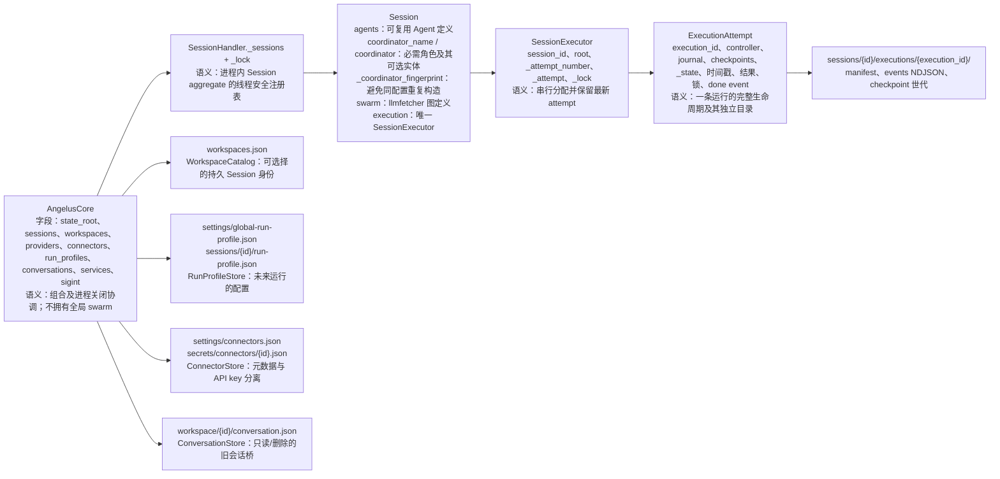

# 当前代码架构与符号语义（Mermaid）

> 基于当前工作树的源码、根目录及各子目录 `INDEX.md` 于 2026-08-31 梳理。本文的“当前运行时”只指由 `angelus.api.include_api_routes` 实际挂载的路径；`llmfetcher/` 是随仓库检出的运行时子模块，本文只列出 Angelus 使用的接口，不将其内部所有符号误归为 Angelus 所有。

## 1. 运行时模块、入口与依赖

```mermaid
flowchart TB
    CLI["`angelus.__main__ → cli.main`<br/>命令行入口：创建 Core，分派 session / web"]
    TAURI["`src-tauri/src/main.rs`<br/>桌面壳：选端口、启动 Python sidecar、承载 WebView"]
    API["`angelus.api.include_api_routes`<br/>挂载现行 FastAPI 路由、静态资源与关闭钩子"]
    UI["`frontend/`<br/>静态 Workbench：选择 Session、配置连接器/配置文件、启动/停止执行"]
    CORE["`AngelusCore`<br/>进程组合根；唯一的跨模块对象拥有者"]

    CLI --> CORE
    TAURI --> CLI
    API --> CORE
    API --> UI
    UI -->|HTTP / SSE| API

    CORE --> APP["`application_module`<br/>SessionService / ExecutionService / SettingsService<br/>传输无关的跨域用例"]
    CORE --> SESSION["`session_module`<br/>Session aggregate + SessionHandler registry"]
    CORE --> EXEC["`execution_module`<br/>attempt、journal、checkpoint、SIGINT、状态"]
    CORE --> STORE["持久化域<br/>workspace / settings / connector / conversation"]
    SESSION --> SWARM["`swarm_module.SessionExecutor`<br/>每个 Session 的唯一 attempt 边界"]
    SESSION --> LLM["`llmfetcher` 子模块<br/>Agent、AgentSwarm、LLMBackendConfig、ExecutionController"]
    EXEC --> LLM
    APP --> SESSION
    APP --> STORE

    LEGACY["`api/compact.py` · `api/external_agents.py` · `api/mcp.py`<br/>保留的旧源文件：依赖缺失的旧模块，未由 include_api_routes 挂载"]
    API -. 不注册 .-> LEGACY
```

## 2. 所有权、状态与持久化边界



## 3. 后端类、字段、类方法与实例方法语义

```mermaid
classDiagram
    class AngelusCore {
      +Path state_root "Angelus 自有状态根"
      +SessionHandler sessions "Session 聚合注册表"
      +WorkspaceCatalog workspaces "持久身份目录"
      +ProviderCatalog providers "运行时能力目录"
      +ConnectorStore connectors "连接器元数据和秘密"
      +RunProfileStore run_profiles "未来运行配置"
      +ConversationStore conversations "旧转录桥"
      +SessionService session_service
      +ExecutionService execution_service
      +SettingsService settings_service
      +SigintSupervisor sigint
      +install_signal_handlers() "安装收件器并启动 drain 线程"
      +drain_signals() bool "处理排队的 SIGINT"
      +receive_sigint() "第一次 Ctrl+C 快照并强制停止"
      +shutdown() "等待/持久化后恢复信号处理器"
      -_drain_signal_loop() "低延迟轮询 SIGINT 工作"
    }
    class Session {
      +List agents "可复用 agent；coordinator 位于 0"
      +String coordinator_name "稳定角色名"
      +Agent coordinator "有已保存凭证时才实体化"
      -Tuple _coordinator_fingerprint "配置指纹"
      +AgentSwarm swarm "跨运行保留的图定义"
      +SessionExecutor execution "本 Session 唯一执行边界"
      +add_agent(agent) "保留一个配置好的 Agent"
      +configure_execution(id, root) "一次性绑定执行边界"
      +set_coordinator(agent, fingerprint) "替换 coordinator 而保留 worker"
      +coordinator_matches(fingerprint) bool "是否可复用 coordinator"
    }
    class SessionHandler {
      -Dict _sessions "id 到完整 Session 的进程内映射"
      -RLock _lock "注册、删除与快照保护"
      +create(id, agents, root) Session "创建并发布 aggregate"
      +add_agent(id, agent) "向既有 Session 添加 agent"
      +agents(id) Tuple "不可变 Agent 快照"
      +get(id) Session "查找 aggregate"
      +remove(id) Session "取消注册并返回 aggregate"
      +exists(id) bool "只读存在性判断"
      +live_attempts() Tuple "供统一关机枚举活跃 attempt"
    }
    AngelusCore --> SessionHandler
    SessionHandler "1" o-- "*" Session

    class SessionExecutor~ResultT~ {
      +String session_id "标准化逻辑 Session ID"
      +Path root "attempt 父目录"
      -int _attempt_number "本进程单调序号"
      -ExecutionAttempt _attempt "最新 attempt"
      -RLock _lock "并发 start/stop/snapshot 保护"
      +start(operation) ExecutionAttempt "没有 live attempt 时分配并启动"
      +request_stop(force, reason) ExecutionSnapshot "转交取消"
      +wait(timeout) bool "等待当前 attempt"
      +snapshot() ExecutionSnapshot "当前或合成 idle"
      +result ResultT "最新成功结果"
      +attempt ExecutionAttempt "当前/最新 attempt"
    }
    Session --> SessionExecutor

    class ExecutionAttempt~ResultT~ {
      +String session_id "父 Session"
      +int attempt "重试/运行序号"
      +String execution_id "全局唯一目录 ID"
      +Path root "独占 executions/id 目录"
      +ExecutionController controller "每 attempt 取消权威"
      +ExecutionJournal journal "追加生命周期证据"
      +CheckpointStore checkpoints "图/上下文世代提交器"
      -ExecutionState _state "受锁保护的状态"
      -Event _done "worker 终态信号"
      +start(operation) "创建非 daemon worker"
      +request_stop(force, reason) ExecutionSnapshot "记录并转发停止请求"
      +wait(timeout) bool "等待 worker 终态"
      +snapshot() ExecutionSnapshot "一致的内存投影"
      +result ResultT "成功后可读结果"
      +commit_checkpoint(generation, graph, contexts, reason) Dict "原子持久化并记录"
      +mark_interrupted(reason) "超期但未证实退出时写 interrupted"
      -_run(operation) "发布 completed/stopped/failed 互斥终态"
      -_write_manifest() "刷新紧凑状态投影"
    }
    SessionExecutor --> ExecutionAttempt

    class ExecutionState {
      <<enumeration>>
      IDLE "未运行"
      RUNNING "worker 执行中"
      STOPPING "协作停止中"
      FORCE_STOPPING "强制停止中"
      COMPLETED "成功"
      STOPPED "取消后退出"
      INTERRUPTED "关机截止前未确认退出"
      FAILED "异常失败"
    }
    class ExecutionSnapshot {
      <<dataclass frozen>>
      +session_id "所属 Session"
      +execution_id "attempt ID；idle 为 null"
      +attempt "运行序号"
      +state "规范生命周期状态"
      +started_at / finished_at "墙钟时间"
      +error "紧凑错误/中断摘要"
    }
    ExecutionAttempt --> ExecutionState
    ExecutionAttempt --> ExecutionSnapshot
```

```mermaid
classDiagram
    class ExecutionJournal {
      -Path path "NDJSON 事件文件"
      -String execution_id "写入每条事件"
      -RLock _lock "追加与读取保护"
      +append(type, data) Dict "fsync 后追加带序列/时间的事件"
      +events() Iterator "按行读取有效事件"
    }
    class CheckpointStore {
      +Path attempt_root "本 attempt 目录"
      +ExecutionJournal journal "提交事实的权威记录"
      +Path manifest_path "attempt manifest 位置"
      +commit(generation, graph, contexts, reason) Dict "哈希/原子写入后 journal commit"
    }
    class SigintSupervisor {
      -Callable _live_attempts "Session registry 的活跃 attempt 提供者"
      -float _deadline_seconds "关机最大等待时间"
      -Event _requested "信号回调到 drain 的桥"
      +install() "替换 SIGINT receipt handler"
      +restore() "恢复旧 handler"
      +drain() bool "消费一次排队停止"
      +request_force_stop_all(reason) Tuple "快照并请求强制停止"
      +wait_for_stop_all(attempts, reason) "等到截止；未退出则 interrupted"
      +force_stop_all(reason) "组合请求和等待"
    }
    ExecutionAttempt --> ExecutionJournal
    ExecutionAttempt --> CheckpointStore
    SigintSupervisor --> ExecutionAttempt

    class Workspace {
      <<dataclass frozen>>
      +session_id "稳定身份"
      +name "展示名"
      +project_path "可选用户项目目录"
      +state_path "Angelus 专属状态路径"
      +to_json() Dict "JSON-safe codec"
      +from_json(value) Workspace$ "验证并恢复记录"
    }
    class WorkspaceCatalog {
      +Path path "workspaces.json"
      -RLock _lock "目录读改写保护"
      +list() Tuple "按名称/ID 稳定排序"
      +get(id) Workspace "查询记录"
      +add(workspace) "拒绝覆盖后原子写入"
      +remove(id) Workspace "删除持久身份"
      +import_legacy_sessions(path, root) Tuple "一次性导入旧索引"
      +remove_legacy_session(path, id) "确认删除时更新旧索引"
      -_read/_records() "验证并解码目录"
      -_write/_write_legacy_index() "fsync + replace 发布"
    }
    WorkspaceCatalog --> Workspace

    class ConnectorStore {
      -Path _metadata_path "公开 connectors.json"
      -Path _secret_root "每连接器私有 API key 文件"
      -RLock _lock "目录/秘密一致性"
      +list() Tuple "无秘密公开投影"
      +create(values) Dict "创建元数据及可选秘密"
      +replace(id, values) Dict "空 key 保留原秘密"
      +remove(id) "删除已验证未引用连接器"
      +exists(id) bool "元数据存在性"
      +api_key(id) String "仅执行构造期读取秘密"
      -_records/_write_records/_write_secret() "私有 JSON 读写"
      -_validate/_validate_id/_public() "字段/路径安全和脱敏"
    }
    class ProviderCatalog {
      +list() Tuple "从 LLMFetcher 枚举并稳定去重 provider"
    }
    class RunProfileStore {
      -Path _root / _global_path "配置根及全局文档"
      -RLock _lock "配置事务保护"
      +global_profile() Dict "完整全局默认值"
      +replace_global(values) Dict "验证并原子替换"
      +session_profile(id) Dict "全局+覆盖的有效配置"
      +replace_session(id, values) Dict "保存完整 Session 覆盖"
      +clear_session(id) Dict "恢复继承"
      +effective(id) Dict "供 attempt 冻结的配置"
      +connector_references(id, ids) Tuple "删除前找显式/继承引用"
      -_read/_session_path/_validated() "安全读取、路径和类型校验"
    }
    class ConversationStore {
      -Path _legacy_root "旧 workspace 根"
      +page(id, before, limit) Dict "倒序游标的时间顺序页"
      +remove(id) "根约束后删除旧 archive"
      -_read_legacy(id) List "容错读取/投影旧 JSON"
    }
```





## 4. 服务层、构造函数和全局函数语义

```mermaid
flowchart TB
  SS["`SessionService(core)`<br/>跨注册表、目录、配置、连接器的 Session 用例"]
  SS1["`create(id,name,project)`：验证项目，注册 Session + Workspace"]
  SS2["`list()`：仅读可持久选择的 Workspace"]
  SS3["`ensure_coordinator(id)`：从已保存 connector/profile 构建或复用 coordinator"]
  SS4["`delete(id,confirmation,timeout)`：强制停止→等待→受限删除状态/旧记录/目录/注册"]
  SS --> SS1 & SS2 & SS3 & SS4

  ES["`ExecutionService(core)`<br/>只经由 `Session.execution` 处理运行；不拥有 executor"]
  ES1["`start(id,message)`：确保 coordinator，启动新的 attempt"]
  ES2["`status(id)`：当前状态或有效 Session 的合成 idle"]
  ES3["`stop(id,force,reason)`：同一 controller 的协作/强制取消"]
  ES4["`events(id)`：读取最新 attempt 的 NDJSON journal"]
  ES5["`_require_session(id)`：缺失时抛 `UnknownSession`"]
  ES --> ES1 & ES2 & ES3 & ES4 & ES5

  SET["`SettingsService(core)`<br/>设置跨存储事务边界"]
  SET1["profile reads/replaces/clear：只影响未来 attempt"]
  SET2["connector list/create/replace：秘密不出服务边界"]
  SET3["`delete_connector`：先查全局及继承引用再删除"]
  SET --> SET1 & SET2 & SET3

  FACT["`create_agent(backends, tools, ...)`<br/>把 LLMFetcher、ContextHandler、工具和默认运行参数装配为 Agent"]
  JSON["`read_json(path,default)`：仅缺文件回 default<br/>`write_json(path,value)`：fsync 临时文件后 replace"]
  SNAP["`interruption_snapshot(graph, execution_id, reason)`<br/>把执行图转换成中断时可恢复的快照"]
  ERR["`UnknownSession`<br/>生命周期/设置请求所指 Session 未注册时的领域错误"]
```

## 5. API、CLI 和前端函数语义

```mermaid
flowchart LR
    subgraph CLI[CLI 函数]
      CP["`_parser()`：声明 state-dir、session、web 参数"]
      CS["`_cmd_session(args,core)`：list/create Workspace"]
      CW["`_cmd_web(args,core)`：建 FastAPI，包装 Uvicorn SIGINT"]
      CM["`main(argv)`：解析参数，创建 Core，分派命令"]
      CP --> CM
      CS --> CM
      CW --> CM
    end
    subgraph HTTP[当前挂载的 FastAPI 函数]
      IR["`include_api_routes(app,core)`：保存 core、挂 router/静态文件、shutdown→core.shutdown"]
      SR["sessions：`list_sessions` / `create_session` / `delete_session` / `get_session_messages`<br/>语义：Session 身份与旧会话分页"]
      RR["runs：`start_run` / `run_status` / `_stop` / `stop_run` / `force_stop_run` / `run_events`<br/>语义：attempt 生命周期与 NDJSON SSE"]
      PR["providers：`list_providers`<br/>语义：读取可用 LLM provider"]
      DR["workspace_directory：`pick_workspace_directory`<br/>语义：桌面环境下选择本地项目目录"]
      TR["settings：connector/profile GET/PUT/DELETE 函数<br/>语义：调用 SettingsService 并将领域错误映射为 HTTP"]
      IR --> SR & RR & PR & DR & TR
    end
    subgraph DTO[Pydantic 输入模型]
      D1["`CreateSessionRequest`：name、project_path"]
      D2["`DeleteSessionRequest`：confirmation"]
      D3["`RunRequest`：session_id、message"]
      D4["`StopRequest`：reason"]
      D5["`ConnectorPayload`：name/provider/model/api_url/api_key"]
      D6["`ProfilePayload`：完整 future-run settings"]
    end
    UI["`frontend/static/app.js`<br/>主控制器：`loadWorkspaces` / `switchSession` / `loadHistory` / `loadConnectors` / `restoreSettings` / `persistSettings` / `start`<br/>语义：仅保存 UI 选择态；调用现行 Session API"]
    COMPONENTS["`components/`<br/>`createChatView`：安全渲染历史/流式对话<br/>`createTraceView`：渲染生命周期事件<br/>`renderTaskPlanItem`：递归计划状态<br/>`$` / `escapeHtml`：DOM/转义原语"]
    UI --> HTTP
    UI --> COMPONENTS
```

## 6. 全局变量、常量和外部依赖

```mermaid
flowchart TB
    G1["`DEFAULT_RUN_PROFILE`（profile_store.py）<br/>未来 attempt 的完整默认配置：connector/provider/model、prompt、采样/上限、记忆会话与工具权限"]
    G2["`ResultT = TypeVar(...)`（execution_attempt.py、session_executor.py）<br/>表示一次 operation 的泛型成功结果；无运行时状态"]
    G3["FastAPI 各模块 `router = APIRouter(...)`<br/>路由收集器；只有被 include_api_routes 传入 app 的五个 router 生效"]
    G4["`__all__ = [include_api_routes]`<br/>API 包公开安装函数"]
    L1["`llmfetcher.Agent` / `LLMFetcher` / `LLMBackendConfig`<br/>模型调用、Agent 循环与 provider 配置"]
    L2["`llmfetcher.AgentSwarm` / `ExecutionGraph`<br/>Session 所持有的图定义与中断图快照输入"]
    L3["`llmfetcher.execution.ExecutionController` / `StopMode`<br/>每 attempt 的协作/强制取消协议"]
    G1 --> L1
    G2 --> L3
    G3 --> L1
```

## 7. 依赖与边界结论

```mermaid
flowchart TB
    R1["路由只解析 `app.state.angelus_core` 并调用 Service；不创建 Store / Session / Executor"]
    R2["`AngelusCore` 只装配与关机；Session 才拥有 Agent、AgentSwarm 和 Executor"]
    R3["`RunProfileStore` 的变更只供下一次 `ensure_coordinator` / `ExecutionAttempt` 使用；不会热改运行中 Agent"]
    R4["connector API key 只在 `ConnectorStore.api_key` → `SessionService.ensure_coordinator` 的构造期读取；公开投影仅有 `has_api_key`"]
    R5["Journal 是事件顺序权威；manifest 是状态/重启的紧凑投影；checkpoint 只有被 journal 引用后才可恢复"]
    R6["`llmfetcher/` 是运行时子模块，其更细的符号索引见 `llmfetcher/INDEX.md`；不可当作 Angelus 控制面的源码所有权"]
    R1 --> R2 --> R5
    R3 --> R4
```

