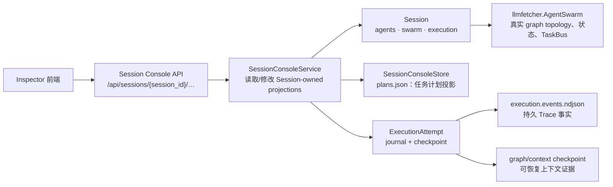
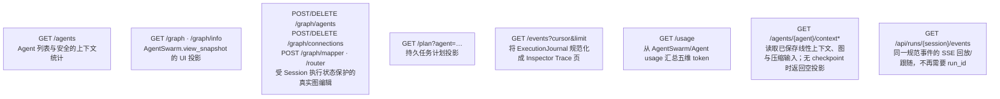

# Session 控制台后端设计

> 目标：保留 Workbench 右侧的任务计划、Agents/执行图、Trace、用量及 Agent 上下文查看能力，但所有状态均以新 `Session` aggregate 为唯一所有者；不恢复旧 `/api/workspaces/{workspace_id}/runs/{run_id}` 模型。

## API 契约

## 不变量

- 图编辑在运行中仅可使用 `AgentSwarm` 明确支持的动态变更；初版 API 会拒绝会改变已完成节点语义的静态编辑。
- 每次执行的 Trace 由 `ExecutionAttempt.journal` 持久化；Graph/Agent 生命周期事件写入同一 journal，再由控制台投影为 UI 事件。
- Agent 及其图的真实来源是 `Session.swarm`；`SessionConsoleStore` 仅保存计划等不能从运行时图推导的控制台投影。
- API 不返回 API key、LLM endpoint、系统提示词或工具配置。

